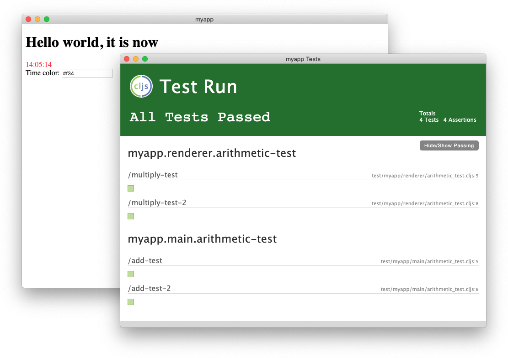

# electron-template

A clj template for for an [Electron](https://electronjs.org) application built with [deps.edn](https://clojure.org/reference/deps_and_cli), [Figwheel Main](https://figwheel.org), [Reagent](http://reagent-project.github.io), and test integration via [cljs-test-display](https://github.com/bhauman/cljs-test-display).

## Usage

    clojure -A:new electron-app myname/myapp

This will generate an Electron app with a main process (source for which is located in `src/main`), a single renderer process (`src/renderer`) and unit tests for both (`src/test`).

## Building

Before anything else, install Node dependencies:

    npm install

### Development

To run a development build:

    clojure -A:dev

This will compile and run your Electron app, and display two windows, one containing your renderer, the other your tests displayed via clj-test-display:



After the application has started, you should have a REPL running, with three Figwheel sessions connected (one for the main process, one for the renderer, and one for the tests). You can see these three sessions with `(conns)`:

```
cljs.user=> (conns)
Will Eval On:  Lilliana
Session Name     Age URL
Lilliana          0m /figwheel-connect
Shelia            0m /figwheel-connect
Angila            0m /figwheel-connect
```

And switch between them with `(focus session-name)`.

Go ahead and make changes to your source or via the REPL and watch the UI and/or tests update in real time.

### Building a Release

The main and renderer processes need to be built separately, and then packaged into an executable with [`electron-packager`](https://github.com/electron/electron-packager):

```
clojure -A:main
clojure -A:renderer
npm run package
```

### Running tests from command line

To run tests from the command line (useful for CI builds):

    clojure -A:test

Note that tests are run within an Electron process, so you will need to create a virtual display driver to [run tests on a headless CI system](https://electronjs.org/docs/tutorial/testing-on-headless-ci).

## License

Copyright © 2019 Paul Butcher

Distributed under the Eclipse Public License either version 1.0 or (at
your option) any later version.
